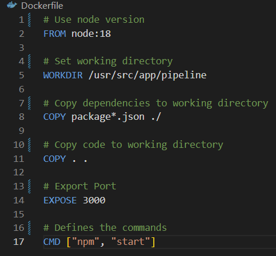
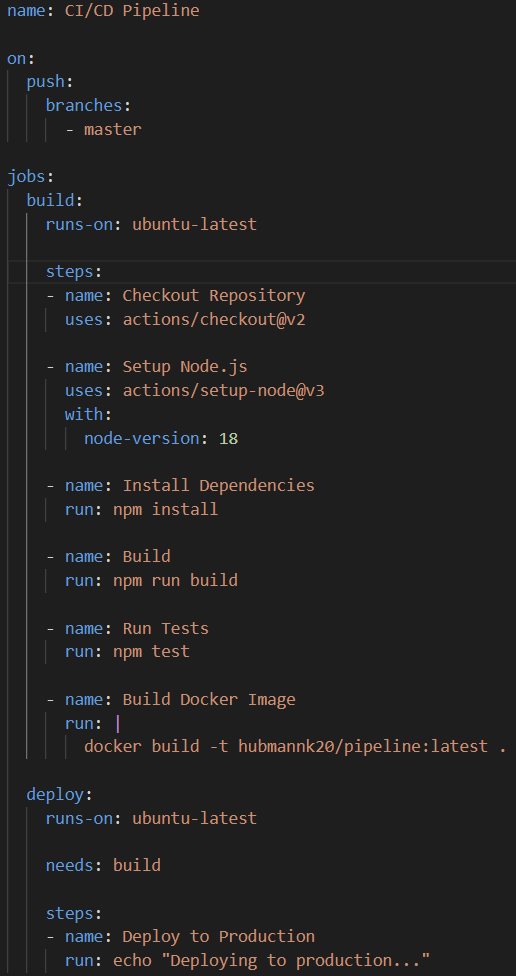

# Technology

## Technologies used

- babel for build
- jest for tests
- docker for containerization

## Docker

### Why use Docker?

Docker provides isolated environments with the help of containers. This isolation helps to avoid conflicts between different applications, versions and dependencies by running each in its own container. It also makes it possible to test the application in all kinds of environments and systems, also making it easier to imitate the setup a possible customer could have. Another advantage of Docker is that the configuration of the containers used can be versioned with the code base.

### Dockerfile



The dockerfile is for the setup of the docker container. First the node version and the working directory are declared, then the dependencies and the code get copied. In the last step the port is exposed and the commands which the docker runs are declared.

## Yaml - file



- on: gets run on every push to the master branch
- jobs: build and deploy jobs, jobs are executed seperately
- build: 
    - checks out the repository
    - sets up node version 18 and builds the dependencies
    - runs the build and tests
    - builds docker image
- deploy:
    - needs a finished build to work
    - simulates a deploy by just printing a string to the console

# Use this project

## On your machine

To set up and run this project on your own machine you need node.js, babel and jest aswell as Visual Studio Code.

### Install Node, Babel and Jest

#### Node - Linux

run `sudo apt install nodejs npm` in your terminal

#### Node - Windows

Download the node installer from the [official website](https://nodejs.org/en/download). Afterwards run `node -v` and `npm -v` to check.

#### Babel and Jest

To install babel and jest run `npm install jest` and `npm install -g @babel/core @babel/cli`

### Repo

Clone the repository with `git clone` and open it in VSCode. Then to finish the setup you need to run `npm install` to install the dependencies from the package.json.

#### Code, Build and Tests

To run the code and execute the index.js just run `npm start`, to build the project run `npm run build` and to test it run `npm test`.

#### Own Pipeline

If you want to use this sample project as a guidline for your own CI/CD Pipeline (at first please don't there are better ones for sure) you need to change one line. In the main.yml file you need to change:
```
- name: Build Docker Image
      run: |
        docker build -t hubmannk20/pipeline:latest .
```
and substitude my username with your own.
